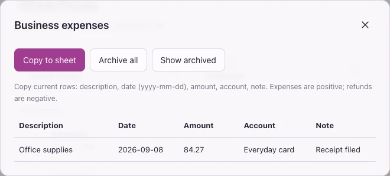

# Trilly

A local, keyboard-driven YNAB review queue. Rust serves a Svelte UI in your
browser. Transaction history, your YNAB token, pending edits, and undo history
live in one encrypted vault on your computer. No external categorization service.

<picture>
  <source media="(prefers-color-scheme: dark)" srcset="docs/screenshots/review-dark.webp">
  <source media="(prefers-color-scheme: light)" srcset="docs/screenshots/review-light.webp">
  
</picture>

<details>
<summary>Settings preview</summary>
<picture>
  <source media="(prefers-color-scheme: dark)" srcset="docs/screenshots/settings-dark.webp">
  
</picture>
</details>

These screenshots predate the top-menu shortcuts, list view, new-payee picker option, inline payee renaming, purchase-history links, and the dev-only rules editor. Screenshot regeneration is pending authorization to run the isolated browser workflow.

Screenshots use synthetic data and the default Iridescent theme. The previews follow your light/dark preference.

Matching payees show a purchase-history link beneath the transaction heading, opening in a new tab. Matching ignores case: “steam purchase” links to Steam; “long & mcquade” or “long and mcquade” links to Long & McQuade; “namecheap” links to Namecheap orders; “paypal” links to PayPal. Buttons show the merchant name and an external-link icon. Press **F** outside text fields and dialogs in transaction view to open the first displayed merchant link. The internal registry is `server/src/purchase_history.json`; add a unique ID, merchant label, HTTPS URL, numeric `priority`, and alternative `payee_contains` phrases to extend it. Links follow the selected payee immediately. Only matches at the highest priority appear; ties retain registry order. Steam, Long & McQuade, and Namecheap use priority 10, while PayPal uses 0 (also the default when omitted), so a specific merchant takes precedence over PayPal. Higher numbers win; additional levels can be added in the registry. When the selected or original payee contains “paypal” and the description is empty, Trilly prefills `via paypal. ` and saves it on approval (or through the description editor). Existing descriptions and explicit description edits are preserved.

In `pnpm dev`, Settings → Development → **Edit purchase history links** opens a wide table. Enter a merchant in the blank bottom row, drag its handle to reorder, or use its X to remove it. Focus a handle and press Up or Down to reorder with the keyboard. Payee phrases use one line per alternative. Closing the modal with its top-right X (or Escape) discards unsaved edits. **Save and commit** writes the entire JSON file and commits only that file on the dev checkout’s current branch, including any existing edits to that file. Other staged and unstaged files remain untouched; this button does not push. Git hooks and signing follow the repository’s configuration. A failed commit leaves the file saved and allows retrying; after a conflicting file edit, close and reopen the editor to load the latest file. Saved rules immediately update the current transaction and its F shortcut in open dev tabs without reloading the app. The installed release uses the rules bundled at build time.

Successful **Save and commit** closes both the editor and Settings; failures keep the draft open for retry. Rule IDs are hidden: new rows receive a random UUID automatically, and existing IDs stay unchanged when a merchant is renamed or reordered.

The editor endpoint exists only in the normal dev server, not release, preview, or synthetic test servers. It checks the loopback Host, Origin, and a custom request header; it does not require vault access and is not protection against other local software. Rules are source code committed to Git: use only public merchant URLs and generic matching phrases, never credentials or personal transaction details. Verify editor logic with `node --test scripts/purchase-history-editor.test.mjs` (temporary synthetic repositories, no browser or Keychain).

Right-click an existing payee in the Payee picker and choose **Rename** to edit
its name in place. **Enter** or leaving the field saves directly to YNAB;
**Esc** cancels before saving. The field shows **Saving to YNAB…** and the
picker waits until YNAB confirms, then shows **Renamed in YNAB**. Renaming
changes the shared payee, including its existing transactions, independently of transaction approval and Undo. Names update
throughout Trilly only after confirmation. If the request fails, the editor
keeps your draft and shows the error; press **Enter** to retry. An interrupted
request may have reached YNAB; sync to check its current name if needed.
Names already used by another active payee are rejected inline, ignoring case
and surrounding whitespace. Trilly also checks the latest YNAB payees before
sending a rename. A concurrent change in another client between that check and
the rename can still race with the request.

Type a payee name in the Payee picker and select **Creating “name”** below the
matches (or as the only option when there are none). **Save & approve** queues
creation and assignment together; YNAB creates the payee during sync. Existing
names are reused. Closing the picker creates nothing. Undo restores the
transaction, but a payee already created in YNAB remains in its payee list.

## Run

Requires macOS, Xcode Command Line Tools, Rust, Node.js, and pnpm.

```sh
pnpm install
pnpm start
```

Your browser opens at **http://127.0.0.1:28753**. Trilly uses your macOS
Keychain to open the vault automatically. Enter your YNAB personal access token
in Settings, then select a plan and account. There is no separate Trilly login.

Trilly now trusts its certificate-signed app, so normal unlocks and rebuilt
versions do not require repeated approval while your Keychain is unlocked.
For an existing vault, macOS may ask you once to approve changing its Keychain
access rules. Confirm that native prompt to authorize the signed Trilly app.
A cancelled migration leaves the original key and vault intact; click Unlock
to retry. A locked Keychain or changed signing identity may still require native
authorization. Your Mac password goes only into macOS dialogs, never Trilly.

If an existing passphrase-protected vault is found, Trilly asks for its old
vault passphrase once, then migrates it to Keychain storage. A wrong passphrase
or cancelled native prompt leaves the original encrypted data intact. The old
encrypted file is retained as a backup when migrating from the previous app
directory. It still requires the old vault passphrase; keep that backup and
passphrase together until you are satisfied with the migration.

### Development and the installed app

```sh
pnpm dev          # frontend hot updates and automatic Rust rebuilds
pnpm start        # build, install, and run the release app
pnpm install:app  # build and install the release app without launching it
```

Each runner installs **~/Applications/Trilly.app**, with bundle identifier
`app.trilly`, and launches the executable inside that permanent bundle. You
can also open the installed app from Finder. It contains its built frontend,
so it remains usable after a temporary development worktree is removed.
Only one runner may update the app at a time; stop it before switching between
`dev` and `start`. Close a directly launched app before starting a runner.
macOS releases the runner lock automatically after a crash; a leftover lock
directory or guard file does not prevent startup.

A certificate-based code-signing identity must be available in your Keychain.
If exactly one is available, the runner selects it and remembers its public
fingerprint in `~/Library/Application Support/trilly-development/signing.json`.
With multiple identities, select one for the first run using
`TRILLY_SIGNING_IDENTITY="certificate name or fingerprint" pnpm dev`.
The runner never exports a private key or falls back to ad-hoc signing. Keep
using the same identity for debug and release builds. If the certificate is
replaced, select its replacement explicitly; Keychain may ask for approval
again. A bundle identifier alone does not establish trust across rebuilds.

In development, Vite serves the existing public port **28753** and proxies API
calls to Rust on loopback port **32943**. Both ports were chosen once using a
cryptographically secure random generator and are recorded in `port.json`.
Svelte and CSS edits update the open page while Rust stays running. Component
hot updates reuse the browser's in-memory session and preserve an explicit
lock; edits that require a full reload reopen through Keychain. Rust edits
build and sign a replacement before restarting the backend and reloading the
page. Failed builds keep the previous backend running.

Dev HTTP and hot-update WebSocket requests enforce the loopback Host and
Origin boundary. Production serves the built UI directly from Rust and does
not run Vite. The development server can serve project source to local
clients; run `pnpm start` when you do not need hot updates.

## Review

| Key | Action |
| --- | --- |
| Enter | Approve the current payee/category and advance |
| 1 / 2 / 3 | Apply that suggested pair, approve, and advance |
| C / E | Search categories / payees; Enter selects |
| S | Skip for this session |
| B | Save a business expense |
| D | Add or edit the transaction description (YNAB memo) |
| ⌘Z / Ctrl+Z / U | Undo the latest skip or review change |
| A | Choose account |
| R | Refresh metadata and sync |
| , | Settings |
| L | Lock |
| ? | Shortcut reference |

Approvals are saved locally before advancing. After three seconds without a new
approval, the app syncs the batch to YNAB. “Pending” means encrypted on disk but
not yet confirmed by YNAB. Closing or locking keeps those changes; unlocking
retries them. Network or rate-limit errors leave them pending for manual retry.
Undo retraces skips and review changes in order. Undoing a skip returns to that
transaction without reversing an earlier approval; repeated Undo restores skips
one at a time. Skip history lasts for the current session and resets when you
review all skipped items or switch accounts or plans.

Undoing a saved change persists a reverse operation so it also works if a
previous response was lost. Undo history keeps the most recent 100 approvals for the selected plan.

Each sync checks for changes made in YNAB before writing. Conflicts remain
pending until you discard the conflicting local edits and review again. YNAB
does not offer conditional transaction updates, so another edit between our
read and write is still possible; avoid editing the same transaction in both
apps simultaneously. Existing splits, transfers, reconciled transactions, and
loan transactions can be approved, but should be edited in YNAB. New payees
are created in YNAB, except canonical Amazon payees, which Trilly can create
when approving an Amazon match. Pending bank transactions are not exposed
by YNAB's transactions endpoint.

The first import fetches history since 2000; later syncs use YNAB's delta cursor.
Suggestions appear above the review actions. Press 1, 2, or 3 on the number
row or numeric keypad to apply a payee/category pair and approve. Physical
number keys also work on layouts that produce symbols and with Num Lock off.
Suggestion shortcuts remain inactive while typing or while a dialog is open.
Suggestions refresh after syncing; the section is hidden when there are no matches. Upcoming suggestions are preloaded. Use E
and C to choose manually. Manually chosen payees and categories use muted styling
and are preserved when a suggestion approves the transaction, including newly created payees.
Crossed-out suggestion values will not apply; fields remain editable. These visual
markers reset when you move to another transaction. Untouched fields keep their
usual appearance. Saving a description mutes it, even if you deliberately leave it
empty. Suggestions never replace descriptions. Category search ranks name prefixes first, then the most
transactions in that category across the current plan, then alphabetically.
Counts exclude deleted transactions and include split categories once per transaction. Descriptions, business expense entry, approvals, and review undo update the screen immediately while
requests save in order. Undo uses Command-Z on Mac, Ctrl-Z, or U; text fields
keep their native undo. The header shows saves in progress and changes pending
YNAB sync. A failed or uncertain save pauses review and offers “Reload saved
state”; later queued actions are cancelled, so check the restored queue before
continuing. Changes still saving in the browser can be lost on reload or lock.

<details>
<summary>Background saving preview (synthetic data)</summary>
<picture>
  <source media="(prefers-color-scheme: dark)" srcset="docs/screenshots/saving-dark.webp">
  
</picture>
</details>

The top controls have text labels, SVG icons, transparent backgrounds, and
subtle outlines. Settings uses a gear icon.

<picture>
  <source media="(prefers-color-scheme: dark)" srcset="docs/screenshots/category-dark.webp">
  
</picture>

Picker searches keep keyboard focus without an outer focus ring; Escape closes
the modal with one press.

The account selector filters the review queue; suggestions use confirmed
history across the selected plan, including approved reconciled transactions.
Transfers, splits, and loan transactions are excluded from suggestion history.
Matching ignores case and punctuation and
compares imported descriptions and saved payee names. Consecutive matching
words rank first (longer phrases win), then multiple shared words in any order,
then single whole-word matches. Frequency, payee identity, amount, account,
matching memos, and recency break ties within the same word-match strength.
A small built-in stop list excludes Vancouver, BC, other common Canadian
locations, and payment noise such as SQ and POS. It is not a complete place-name
database and can also filter a location word used in a business name. Categories
still come from approved history; the app does not invent a category from a
merchant name alone. Corrections start informing
suggestions once YNAB confirms them. This is a local heuristic, not a claim of
better accuracy than YNAB. Sparse or ambiguous history can produce poor choices.

Press **D** or **Add description** / **Edit description** to edit the current
transaction's YNAB memo, labeled Description in Trilly. Enter saves; Shift+Enter
inserts a line break. Existing text starts selected. Empty text clears it. The
500-character limit follows the [YNAB API](https://api.ynab.com/v1).
The dialog closes and the description updates immediately while the change saves
to the encrypted outbox and syncs in the background. You can keep editing or
approve immediately; the save queue syncs the description before sending the next
edit of that transaction. Changes confirmed in the local outbox survive offline
use and can be retried with Sync. A failed prerequisite sync pauses queued edits
and offers Reload saved state. Description changes share approval undo history;
Undo restores the previous memo using a durable reverse edit.

## Diagnostics

Near the bottom of Settings, **Copy diagnostics** copies a report for troubleshooting.
It contains extension versions, timestamps, operation names, allowlisted error
categories, collection counts, HTTP status codes for Amazon vault and sync requests, and
extension source file line numbers when available. It excludes raw exception
messages and stacks, URLs, order/payment details, transaction IDs, credentials,
and page contents. Nothing is uploaded automatically. The past-transaction count
appears below Diagnostics, at the very bottom of Settings.

App diagnostics use tab session storage; extension diagnostics use Chrome session
storage so worker restarts do not lose the error. Each keeps at most 80 events;
reports include only the last 24 hours. If storage fails, diagnostics remain in
memory. Opening Settings refreshes the extension report; its retrieval timestamp
and availability are included. Reload the updated Amazon extension before retrying
collection. If clipboard access fails, Settings displays the report for manual
selection and copying. Clipboard and browser behavior have not been exercised
without fresh authorization.

## Amazon purchases and refunds

Import your bank CSVs into YNAB first. When unapproved Amazon transactions are
present, **Fetch Amazon details** starts a batch for all accounts in the selected
plan. Each fetch stops any previous collection, clears its saved Amazon records,
thumbnails, payment bindings and completion tracking, then starts from scratch.
The replacement scrape starts only after clearing is confirmed; existing orders
are fetched again. Install the [Trilly Amazon extension](chromium-extension/README.md) through
Chrome's **Load unpacked** control first, then reload Trilly. Trilly checks the
extension version against its bundled manifest and blocks collection if they differ
(or the installed extension is too old to report a version). After updating the
repository, reload **Trilly Amazon** in `chrome://extensions`, then reload Trilly.
Paste `chrome://extensions` into Chrome’s address bar and press Enter; Chrome blocks
websites from linking to this page. Click the inline address in the update notice or
**Amazon setup** to copy it; a brief **Copied** overlay confirms success. The address
can also be selected and copied manually. **Amazon setup** also provides an HTML-paste fallback for payments and order-detail pages.

Payees containing **Kindle Svcs** (including the original imported payee) use
this same matching flow. Digital `D`-prefixed order IDs are accepted alongside
standard order IDs. Unrecognized digital-page layouts still pause for review.

Only payments with the same signed amount and a date within 14 days of a target
transaction lead to order-detail collection. Missing dates and differing or unknown
currencies remain ambiguous candidates for manual review. All plausible matches
are retained, rather than choosing the first payment. Unrelated payment rows are
scanned for pagination but are not saved. Approvals remove waiting order work;
Undo restores already-scanned candidates. Orders already loading may finish.
The target set is limited to transactions present when Fetch was pressed; newly
imported transactions remain eligible for the next fetch.

Collection reads payments only from Amazon.ca in a separate unfocused
window and follows order links to Amazon.ca or Amazon.com using your sessions.
Up to six order tabs work alongside one payment reader; pagination and
order extraction overlap. Finished tabs close, with one blank tab kept open
until queued orders and saves finish so the collection window remains available.
Duplicate packet retries share one pending save. Results arrive as they
are saved, and you can keep reviewing other transactions. **Stop** cancels the
job. Sign-in, Amazon challenges, changed markup and timeouts pause the affected
pages; use **Open page** and **Resume**. The collector only controls its own tabs.
It scans back to the oldest unapproved Amazon transaction plus a 14-day margin,
with a 100-page payment limit. Each fetch requests fresh order details,
including refunds. Order tabs use the marketplace in each Amazon order
link, which can differ from the payments page. Matching retains this destination
alongside the original payment source and currency. Existing cached payments
without link destinations use their original marketplace until fetched again.
Restart collection to retry missing work. Earlier versions scanned both payment
pages and could save the same payment under two source-specific IDs. Fetch again
to replace those cached records (this also clears local payment bindings, without
changing YNAB).
Selecting a marketplace reuses the existing payee's name and capitalization;
only a missing payee falls back to the domain as its new name.

Trilly displays an order card with lowercase product titles, optional thumbnails,
quantities, unit prices, sellers, shipment and return information, payment method,
order date and number, item subtotal, shipping, tax, discounts and other summary
rows supplied by Amazon. Related collected charges and refunds appear below the
card. **Payment details from Amazon** stays visible with separate rows for the
date, amount, payment method, payment source, and linked order numbers. Order
links are available even before their details finish collecting.
**Open order** opens the original Amazon order; product links are available
on titles. Cards are rebuilt from structured fields. Raw Amazon HTML, scripts,
addresses and account credentials are not stored or rendered.

Matching keeps charges and refunds separate and uses exact signed amount and
currency, nearby payment dates and uniqueness among bank transactions. Card
information remains visible for manual comparison; account-to-card mapping is
not inferred. Unknown dates, currency differences, competing transactions and
repeated amounts require review. A selected payment is bound to the approved
YNAB transaction so later reviews cannot automatically reuse it. Undo releases
that binding. These are local heuristics, not a guarantee of identity.

After collection finishes, an unambiguous product match proposes a lowercase
YNAB description and the `amazon.ca` or `amazon.com` payee. Refund descriptions
use **refund for [product]**. Full-order purchases can list multiple products;
partial charges and multi-product refunds require choosing the relevant items.
Existing descriptions and manually selected payees are preserved until you
explicitly replace them. Long generated descriptions are shortened to YNAB's
500-character limit; complete product titles remain in the card.

Automatic descriptions are drafts until **Approve** writes the description,
payee, category and approval together through the existing encrypted outbox.
Missing canonical Amazon payees can be created by that same YNAB update. Undo
restores the previous description, payee, category and approval. Explicit edits
through **D / Save description** retain the existing immediate-save workflow,
normalize Amazon descriptions to lowercase, and sync before approval.

For ambiguous orders, select a payment and its products, or search collected
orders by product or order number. The app offers combinations of recorded item
prices that equal the payment, but labels them as suggestions: prices can exclude
taxes, discounts or fees, and equal totals do not establish which items were paid
for. Quantity-specific partial refunds may need manual adjustment. A selected
multi-item purchase shows item subtotals to help prepare a category split in
YNAB. Trilly does not create or edit splits; the YNAB API does not support updating
subtransactions on an existing split. No estimated tax rates are invented.

Each collected batch is saved to the encrypted vault before acknowledgement;
collection completes only after all batches are saved. Records survive app and
browser restarts and are merged by identity rather than appended as duplicates.
After a complete scrape, the collection card hides until another Amazon transaction
appears that was not covered by that scrape. Only covered transaction IDs are
retained alongside the cache. Interrupted or limited scrapes remain retryable.
After a successful sync confirms that every transaction across the selected plan
is reviewed and no pending writes or conflicts remain, Trilly automatically
deletes collected Amazon records, thumbnails and payment bindings. Late collection
packets cannot refill an already finished review. Undo still restores transaction
fields, but Amazon details must be fetched again after cleanup. Deletion replaces
the current vault; it cannot erase older filesystem snapshots or backups.

Older optional
thumbnails are dropped above a 16 MB image budget; textual evidence remains. **Clear collected
Amazon data** removes this cache and payment bindings; it does not change YNAB
transactions. The extension uses memory-only session storage for its job and
unacknowledged textual records, with bounded thumbnail transfers. A small completion
receipt lets Trilly recover a missed final status; it is removed after Trilly saves
completion or its tab closes. The bridge is
restricted to Trilly's exact loopback origin and uses the app's existing
authenticated API. It never receives the YNAB token or vault credential. Lock,
plan changes and closing Trilly cancel collection. Reload stops the old job;
already saved records remain available. Amazon receives the normal page and
thumbnail requests; there is no telemetry or external AI service.

Live Amazon traversal and the new UI have not been verified in an automated
browser. Validation uses the user-supplied local order layouts, synthetic DOM,
Chrome API mocks, server-rendered cards and isolated Rust vault/API tests. The
existing README screenshots show the standard review flow; Amazon screenshots
await fresh authorization to run the isolated browser workflow. Local
`example*.html` references are ignored and must never be committed.

## Business expenses

Press **B** or click **Business expense** while reviewing to open **Add business expense**. The description defaults to the selected payee followed by the first sentence of the transaction description, separated by ` - `. Any text after the first `. ` fills the optional note. The description starts fully selected, so typing replaces it; Enter saves, Shift+Enter adds a line in text fields, and Tab moves through the price and optional note. The price is editable and defaults to the transaction amount with expenses positive and refunds negative, so refunds subtract from the total. Reopening a saved expense preserves its edited price. The button remains available after saving; reopening it edits that transaction's existing expense instead of creating another row.
Date, amount, and account are captured from the transaction. This does not approve
or modify the YNAB transaction. The header's **Business** count opens the saved table.

**Copy to sheet** copies current rows without headers in this order: description,
`yyyy-mm-dd` date, amount, account, note. Paste into the first destination cell.
Amounts reverse the YNAB sign: expenses are positive and refunds negative, with
up to three decimal places preserved. Excel's destination format and regional
settings control date/number display; format the date column as `yyyy-mm-dd` if needed.
Tabs and line breaks within text become spaces, and formula-like text is prefixed
with an apostrophe to keep it literal. Copying places plaintext on the system
clipboard, outside vault encryption; clipboard managers may retain it.

Expenses and archives survive restarts, syncs, account changes, plan changes, and
token replacement in the encrypted vault. The queue combines saved expenses across
plans; amounts are not currency-converted. Every table field is editable; each row's
**Save** writes its changed description, date, amount, account, and note. The business
table and development purchase-history editor share the same editable table component.
**Archive all** clears the current queue without deleting records. U or Command-Z / Ctrl-Z reverses business
expense additions, edits, removals, and archives, newest first, including after restart.
The most recent 100 business changes are retained. Outside text fields, Undo
reverses business changes in the business dialog. In review, it restores the
latest skip first; otherwise business changes take priority over approvals.
Use the rightmost SVG close button to remove an individual row; the keyboard shortcut can restore it. The expense form's save button shows
its Enter shortcut. **Show archived** displays older rows.
Saved transactions are updated in place, including archived transactions. Removing
a row or undoing its addition allows that transaction to be added again.

<picture>
  <source media="(prefers-color-scheme: dark)" srcset="docs/screenshots/business-dark.webp">
  
</picture>

## Encryption and its limits

Trilly creates a random **256-bit encryption key** and stores it in the macOS
file-based Keychain. Its decrypt access list trusts the signed Trilly app.
macOS checks the stored code-signing requirement, allowing new builds with the
same signing identity to read the key without another prompt. Production
Keychain access rejects unsigned and ad-hoc-signed executables. This uses
legacy Keychain APIs and does not require an app provisioning profile.

The backend checks the decrypt ACL's shape and app path before requesting the
key; macOS enforces the signing requirement on the actual read. Empty,
unrestricted, or different app lists are migrated to Trilly-only trust through
native authorization. Migration preserves the encryption key and owner ACLs.
A denied or failed access update returns no key and leaves the session locked.

**Lock is a session and memory control, not an authentication barrier.** It
clears the backend's key and data and revokes the browser credential. Unlock,
a page reload, or an app restart can retrieve the key again without proving
you are present. Someone using your unlocked Mac can reopen Trilly. Code signed
with the trusted identity can access the key; this policy also trusts future
builds. Use macOS screen lock to restrict access when you step away.

<details>
<summary>Locked session preview (synthetic data)</summary>
<picture>
  <source media="(prefers-color-scheme: dark)" srcset="docs/screenshots/locked-dark.webp">
  
</picture>
</details>

Native tests use isolated synthetic Keychains. They verify migration preserves
the key, denied migration returns no key, and repeated trusted reads need no
UI. A separate signed fixture is rebuilt with different code and verifies it
can still read, while a different bundle identifier or ad-hoc signature cannot
read silently. No tests access your installed vault or its Keychain item.

**XChaCha20-Poly1305** encrypts and authenticates the entire vault, including
transaction history, token, pending edits, and undo history. Each save uses a
fresh random 192-bit nonce. The format version and random key identifier are
also authenticated. The file contains no plaintext decryption key. An encrypted
temporary file, fsync, atomic rename, and directory fsync protect saves. Vaults
are mode 0600 inside a mode 0700 directory; an instance lock prevents concurrent
writers. A pending `.key-id` file contains only a random identifier, allowing a
cancelled first unlock to retry without creating more Keychain entries.

The encryption key and structured vault data are zeroized when the Rust session
locks. The browser retains only an in-memory session credential and the data it
needs to display. Reloading obtains a new session through the trusted app. Only
appearance and logo preferences go in localStorage. Browser and backend both lock after six
hours of inactivity.

Host and Origin validation, a custom API header, authenticated private
endpoints, no browser caching, and a restrictive Content Security Policy protect
the local server. Browser traffic stays on HTTP loopback; YNAB traffic uses
HTTPS. There are no external categorization services, third-party remote scripts,
telemetry, or transaction/token logs.

The Google “G” button beside the transaction date opens a payee search in a new
tab. Press **G** in transaction view to open the same search; the button shows
this shortcut. Clicking it or pressing G sends the selected payee name to Google;
no search is sent until you activate it.

**An unlocked app still handles plaintext.** A sufficiently privileged agent,
debugger, extension, or modified app could access it. Keychain storage does
not isolate a running app from every process on your Mac. JavaScript and
HTTP-library buffers cannot reliably be wiped; OS swap/crash dumps are outside
Trilly's control. Use FileVault and a trusted browser, and lock Trilly before
asking an agent to work on it. [AGENTS.md](AGENTS.md) forbids inspection of real
vaults, Keychain secrets, unlocked browsers, and process memory.

Data lives at `~/Library/Application Support/trilly/data.vault`. Back up the
vault **and your Keychain** using a trusted Mac backup mechanism. A vault file
alone cannot be restored on another Mac without its corresponding Keychain key.
There is no application recovery-password bypass. Legacy passphrase vaults use
Argon2id (64 MiB, three iterations, one lane) only for the one-time migration.

## Themes

The eleven theme presets, daily Random selection, and light/dark palettes come
from the author's Balance app. Iridescent is the default; system appearance is
followed live. Settings offers Light, Dark, and System circles, and a Random
sub-button to start daily themes tomorrow. Theme choice can be changed while locked.
Every theme has a soft gradient background using only its own palette in both
light and dark appearance; Graphite stays neutral and Iridescent stays prismatic.
Dark gradients have a lifted base to keep the darkest areas soft rather than near-black.

The logo uses Avenir Next with fixed CSS weight 750 and −0.8px letter spacing. The
installed font determines the available rendered weight; fonts load locally
without network requests. Its default color is `#56c2f0` in both light and dark
appearance. Settings keeps a color picker with hex and hue/saturation/lightness
controls and a reset button.
A live logo preview sits above the controls and matches the header wordmark.
The outlined Reset logo button is disabled when the color matches its default.
Color changes preview live and persist across reloads. Reset restores `#56c2f0`.
Existing custom colors are preserved. Payee and category pickers focus search
immediately; click outside any modal or press Escape to close it.
The compact layout also takes inspiration from the author's Compressor app.

## Contributing and screenshots

Do all work in a dedicated Git worktree. After completing a requested change,
verify and commit it, integrate it onto main, and push main to GitHub. Remove
the temporary worktree and branch afterward. Never commit or push secrets or
personal financial data; see [AGENTS.md](AGENTS.md) for the complete rules.

Browser tests, screenshots, clipboard access, Keychain tests and native UI
require fresh explicit user authorization before running (see AGENTS.md). When
authorized, refresh the screenshots displayed in this README with UI changes:

```sh
pnpm screenshots
```

This builds the frontend, opens an isolated static preview with synthetic API
fixtures, and writes light/dark review, settings, picker, and locked-session WebPs to `docs/screenshots/`.
It does not connect to the running app or start a backend. Review all WebP
images, update the README references or
captions when necessary, and commit and push them with the UI change so the
GitHub preview stays current. Never take documentation screenshots of real data.

## Verification

```sh
pnpm check
pnpm build
pnpm test:amazon
pnpm test:sort
cargo test --manifest-path server/Cargo.toml -- --skip native_keychain_migrates_synthetic_rules_and_preserves_key
# The following workflows require fresh explicit authorization:
pnpm test:browser
pnpm test:dev
pnpm test:signing
```

Browser tests use an isolated temporary vault, a separate permanent random test
port, and a debug-only synthetic authentication provider. They never open your
real vault or its Keychain item, or interrupt the running app. Development and
signing tests use your existing signing identity without exporting its key. Synthetic authentication is excluded
from normal builds and cannot compile in release mode. Chrome is used if
installed; otherwise install Playwright Chromium with
`pnpm exec playwright install chromium`. API fixtures, screenshots, passwords,
and encryption tests contain only synthetic data. Rust tests exercise actual
HTTP requests against a local mock YNAB server, including lost responses,
conflicts, delta sync, and undo. No real YNAB token is needed for tests.

The backend's `TRILLY_DATA_DIR` override exists for isolated testing. Never
point automated tests at the normal vault directory. `TRILLY_NO_OPEN=1 pnpm start`
runs the server without automatically opening a browser.

References: [YNAB API](https://api.ynab.com/),
[endpoint specification](https://api.ynab.com/papi/open_api_spec.yaml),
[macOS Keychain](https://developer.apple.com/documentation/technotes/tn3137-on-mac-keychains),
[code-signing requirements](https://developer.apple.com/documentation/technotes/tn3127-inside-code-signing-requirements),
[Argon2](https://docs.rs/argon2/0.5.3/argon2/),
[XChaCha20-Poly1305](https://docs.rs/chacha20poly1305/0.10.1/chacha20poly1305/).

### Review views and menu shortcuts

The top menu shows Option shortcuts on macOS (⌥), and Alt+ elsewhere:
**T** Transaction, **V** List, **R** Sync, **U** Undo, **B** Business,
**H** Help, **S** Settings, and **L** Lock. Existing single-key shortcuts
remain available. Menu shortcuts do not run while a dialog is open.

List shows every transaction in the selected account's current review batch
with date, payee, category, description, amount, and review status. Click any
column heading to sort ascending; click again for descending. Transaction view
follows that same order, starting with the topmost unreviewed, unskipped row.
Switching to List scrolls the current transaction a quarter of the way down the
window, or as close as the page's scroll limits allow. Above the table, the batch
heading shows the counts to review and reviewed.
Sorting defaults to date ascending and lasts for the browser session. Choose
**Review** on a row to open it in Transaction view. Approved rows stay gray,
including after sync and restart. Once the batch is complete, newly arriving
unreviewed transactions start the next batch. Skipping does not count as approval.
Undo reopens a reviewed transaction in its batch. Review batches are stored in
the encrypted vault; no transaction data is stored in browser storage.
