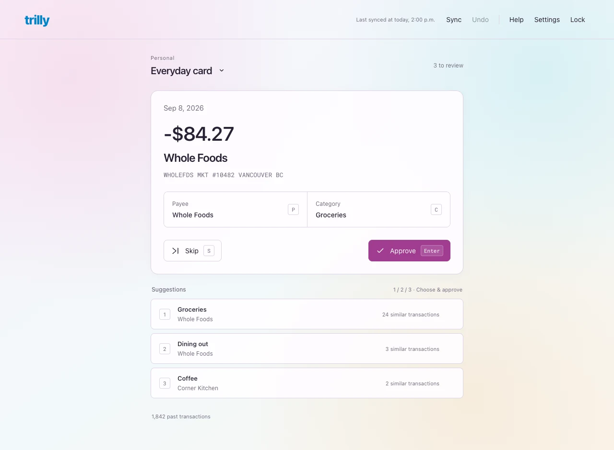
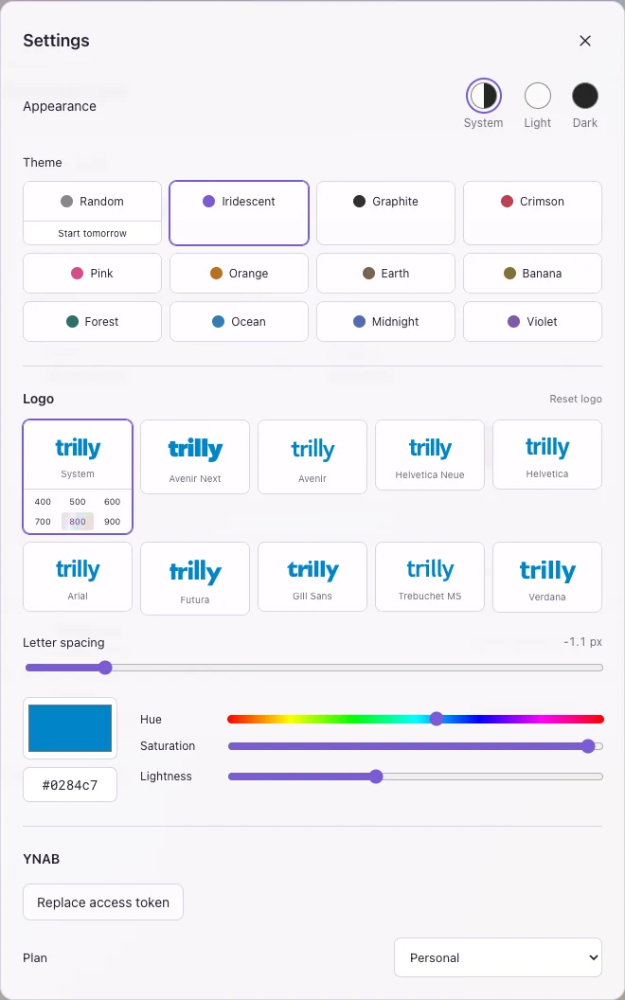
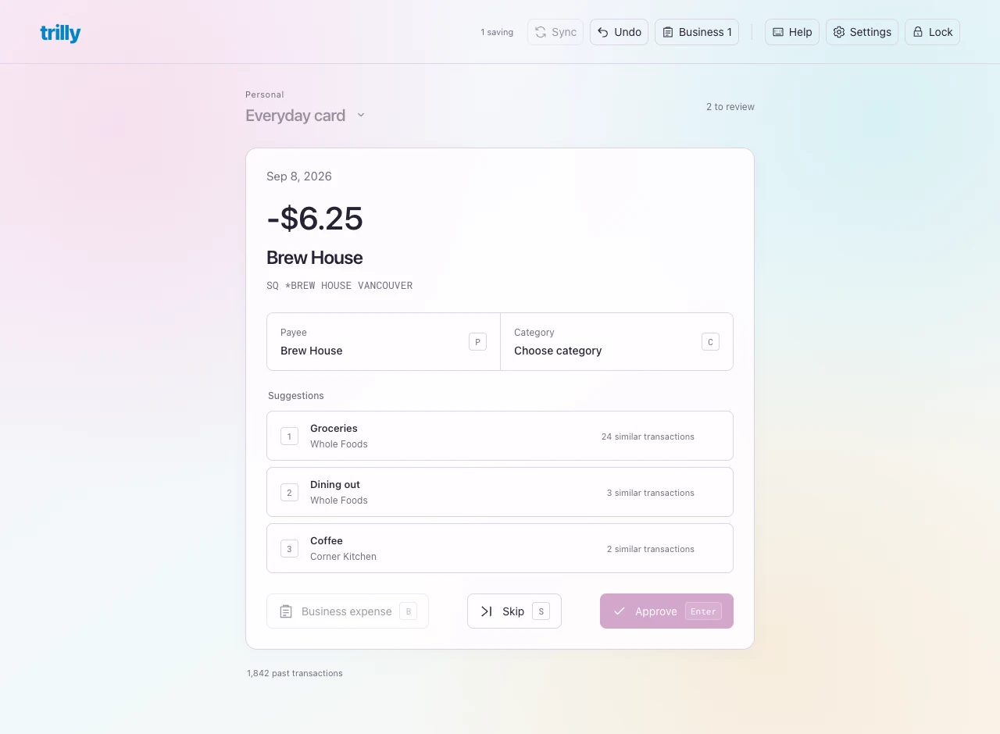
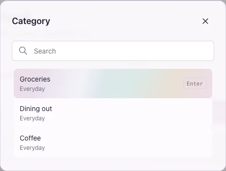
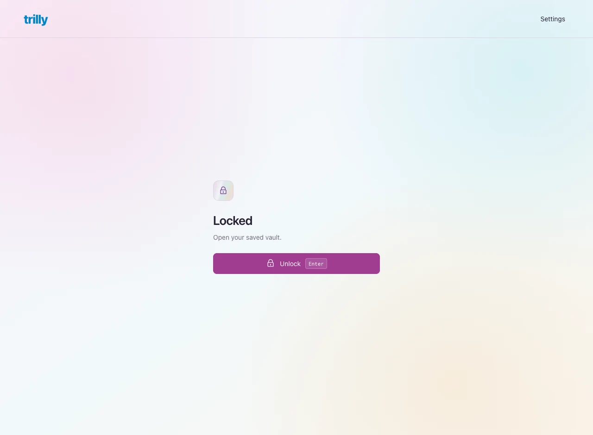

# Trilly

A local, keyboard-driven YNAB review queue. Rust serves a Svelte UI in your
browser. Transaction history, your YNAB token, pending edits, and undo history
live in one encrypted vault on your computer. No external categorization service.

<picture>
  <source media="(prefers-color-scheme: dark)" srcset="docs/screenshots/review-dark.webp">
  <source media="(prefers-color-scheme: light)" srcset="docs/screenshots/review-light.webp">
  
</picture>

<details>
<summary>Settings preview</summary>
<picture>
  <source media="(prefers-color-scheme: dark)" srcset="docs/screenshots/settings-dark.webp">
  
</picture>
</details>

Screenshots use synthetic data and the default Iridescent theme. The previews follow your light/dark preference.

## Run

Requires macOS, Xcode Command Line Tools, Rust, Node.js, and pnpm.

```sh
pnpm install
pnpm start
```

Your browser opens at **http://127.0.0.1:28753**. Trilly uses your macOS
Keychain to open the vault automatically. Enter your YNAB personal access token
in Settings, then select a plan and account. There is no separate Trilly login.

Trilly now trusts its certificate-signed app, so normal unlocks and rebuilt
versions do not require repeated approval while your Keychain is unlocked.
For an existing vault, macOS may ask you once to approve changing its Keychain
access rules. Confirm that native prompt to authorize the signed Trilly app.
A cancelled migration leaves the original key and vault intact; click Unlock
to retry. A locked Keychain or changed signing identity may still require native
authorization. Your Mac password goes only into macOS dialogs, never Trilly.

If an existing passphrase-protected vault is found, Trilly asks for its old
vault passphrase once, then migrates it to Keychain storage. A wrong passphrase
or cancelled native prompt leaves the original encrypted data intact. The old
encrypted file is retained as a backup when migrating from the previous app
directory. It still requires the old vault passphrase; keep that backup and
passphrase together until you are satisfied with the migration.

### Development and the installed app

```sh
pnpm dev          # frontend hot updates and automatic Rust rebuilds
pnpm start        # build, install, and run the release app
pnpm install:app  # build and install the release app without launching it
```

Each runner installs **~/Applications/Trilly.app**, with bundle identifier
`app.trilly`, and launches the executable inside that permanent bundle. You
can also open the installed app from Finder. It contains its built frontend,
so it remains usable after a temporary development worktree is removed.
Only one runner may update the app at a time; stop it before switching between
`dev` and `start`. Close a directly launched app before starting a runner.
macOS releases the runner lock automatically after a crash; a leftover lock
directory or guard file does not prevent startup.

A certificate-based code-signing identity must be available in your Keychain.
If exactly one is available, the runner selects it and remembers its public
fingerprint in `~/Library/Application Support/trilly-development/signing.json`.
With multiple identities, select one for the first run using
`TRILLY_SIGNING_IDENTITY="certificate name or fingerprint" pnpm dev`.
The runner never exports a private key or falls back to ad-hoc signing. Keep
using the same identity for debug and release builds. If the certificate is
replaced, select its replacement explicitly; Keychain may ask for approval
again. A bundle identifier alone does not establish trust across rebuilds.

In development, Vite serves the existing public port **28753** and proxies API
calls to Rust on loopback port **32943**. Both ports were chosen once using a
cryptographically secure random generator and are recorded in `port.json`.
Svelte and CSS edits update the open page while Rust stays running. Component
hot updates reuse the browser's in-memory session and preserve an explicit
lock; edits that require a full reload reopen through Keychain. Rust edits
build and sign a replacement before restarting the backend and reloading the
page. Failed builds keep the previous backend running.

Dev HTTP and hot-update WebSocket requests enforce the loopback Host and
Origin boundary. Production serves the built UI directly from Rust and does
not run Vite. The development server can serve project source to local
clients; run `pnpm start` when you do not need hot updates.

## Review

| Key | Action |
| --- | --- |
| Enter | Approve the current payee/category and advance |
| 1 / 2 / 3 | Apply that suggested pair, approve, and advance |
| C / P | Search categories / payees; Enter selects |
| S | Skip for this session |
| U | Undo the last approval |
| A | Choose account |
| R | Refresh metadata and sync |
| , | Settings |
| L | Lock |
| ? | Shortcut reference |

Approvals are saved locally before advancing. After three seconds without a new
approval, the app syncs the batch to YNAB. “Pending” means encrypted on disk but
not yet confirmed by YNAB. Closing or locking keeps those changes; unlocking
retries them. Network or rate-limit errors leave them pending for manual retry.
Undo persists a reverse operation so it also works if a previous response was
lost. Undo history keeps the most recent 100 approvals for the selected plan.

Each sync checks for changes made in YNAB before writing. Conflicts remain
pending until you discard the conflicting local edits and review again. YNAB
does not offer conditional transaction updates, so another edit between our
read and write is still possible; avoid editing the same transaction in both
apps simultaneously. Existing splits, transfers, reconciled transactions, and
loan transactions can be approved, but should be edited in YNAB. New payees
must currently be created there too. Pending bank transactions are not exposed
by YNAB's transactions endpoint.

The first import fetches history since 2000; later syncs use YNAB's delta cursor.
Suggestions appear below the review actions. Press 1, 2, or 3 on the number
row or numeric keypad to apply a payee/category pair and approve. Physical
number keys also work on layouts that produce symbols and with Num Lock off.
Suggestion shortcuts remain inactive while typing or while a dialog is open.
Suggestions refresh after syncing; the section is hidden when there are no matches. Upcoming suggestions are preloaded. Use P
and C to choose manually. Approve and undo update the screen immediately while
requests save in order. Undo uses Command-Z on Mac, Ctrl-Z, or U; text fields
keep their native undo. The header shows saves in progress and changes pending
YNAB sync. A failed or uncertain save pauses review and offers “Reload saved
state”; later queued actions are cancelled, so check the restored queue before
continuing. Changes still saving in the browser can be lost on reload or lock.

<details>
<summary>Background saving preview (synthetic data)</summary>
<picture>
  <source media="(prefers-color-scheme: dark)" srcset="docs/screenshots/saving-dark.webp">
  
</picture>
</details>

The top controls have text labels, SVG icons, transparent backgrounds, and
subtle outlines. Settings uses a gear icon.

<picture>
  <source media="(prefers-color-scheme: dark)" srcset="docs/screenshots/category-dark.webp">
  
</picture>

Picker searches keep keyboard focus without an outer focus ring; Escape closes
the modal with one press.

The account selector filters the review queue; suggestions use confirmed
history across the selected plan, including approved reconciled transactions.
Transfers, splits, and loan transactions are excluded from suggestion history.
Matching ignores case and punctuation and
compares imported descriptions and saved payee names. Consecutive matching
words rank first (longer phrases win), then multiple shared words in any order,
then single whole-word matches. Frequency, payee identity, amount, account,
matching memos, and recency break ties within the same word-match strength.
A small built-in stop list excludes Vancouver, BC, other common Canadian
locations, and payment noise such as SQ and POS. It is not a complete place-name
database and can also filter a location word used in a business name. Categories
still come from approved history; the app does not invent a category from a
merchant name alone. Corrections start informing
suggestions once YNAB confirms them. This is a local heuristic, not a claim of
better accuracy than YNAB. Sparse or ambiguous history can produce poor choices.

## Encryption and its limits

Trilly creates a random **256-bit encryption key** and stores it in the macOS
file-based Keychain. Its decrypt access list trusts the signed Trilly app.
macOS checks the stored code-signing requirement, allowing new builds with the
same signing identity to read the key without another prompt. Production
Keychain access rejects unsigned and ad-hoc-signed executables. This uses
legacy Keychain APIs and does not require an app provisioning profile.

The backend checks the decrypt ACL's shape and app path before requesting the
key; macOS enforces the signing requirement on the actual read. Empty,
unrestricted, or different app lists are migrated to Trilly-only trust through
native authorization. Migration preserves the encryption key and owner ACLs.
A denied or failed access update returns no key and leaves the session locked.

**Lock is a session and memory control, not an authentication barrier.** It
clears the backend's key and data and revokes the browser credential. Unlock,
a page reload, or an app restart can retrieve the key again without proving
you are present. Someone using your unlocked Mac can reopen Trilly. Code signed
with the trusted identity can access the key; this policy also trusts future
builds. Use macOS screen lock to restrict access when you step away.

<details>
<summary>Locked session preview (synthetic data)</summary>
<picture>
  <source media="(prefers-color-scheme: dark)" srcset="docs/screenshots/locked-dark.webp">
  
</picture>
</details>

Native tests use isolated synthetic Keychains. They verify migration preserves
the key, denied migration returns no key, and repeated trusted reads need no
UI. A separate signed fixture is rebuilt with different code and verifies it
can still read, while a different bundle identifier or ad-hoc signature cannot
read silently. No tests access your installed vault or its Keychain item.

**XChaCha20-Poly1305** encrypts and authenticates the entire vault, including
transaction history, token, pending edits, and undo history. Each save uses a
fresh random 192-bit nonce. The format version and random key identifier are
also authenticated. The file contains no plaintext decryption key. An encrypted
temporary file, fsync, atomic rename, and directory fsync protect saves. Vaults
are mode 0600 inside a mode 0700 directory; an instance lock prevents concurrent
writers. A pending `.key-id` file contains only a random identifier, allowing a
cancelled first unlock to retry without creating more Keychain entries.

The encryption key and structured vault data are zeroized when the Rust session
locks. The browser retains only an in-memory session credential and the data it
needs to display. Reloading obtains a new session through the trusted app. Only
appearance and logo preferences go in localStorage. Browser and backend both lock after six
hours of inactivity.

Host and Origin validation, a custom API header, authenticated private
endpoints, no browser caching, and a restrictive Content Security Policy protect
the local server. Browser traffic stays on HTTP loopback; YNAB traffic uses
HTTPS. There are no external categorization services, third-party remote scripts,
telemetry, or transaction/token logs.

**An unlocked app still handles plaintext.** A sufficiently privileged agent,
debugger, extension, or modified app could access it. Keychain storage does
not isolate a running app from every process on your Mac. JavaScript and
HTTP-library buffers cannot reliably be wiped; OS swap/crash dumps are outside
Trilly's control. Use FileVault and a trusted browser, and lock Trilly before
asking an agent to work on it. [AGENTS.md](AGENTS.md) forbids inspection of real
vaults, Keychain secrets, unlocked browsers, and process memory.

Data lives at `~/Library/Application Support/trilly/data.vault`. Back up the
vault **and your Keychain** using a trusted Mac backup mechanism. A vault file
alone cannot be restored on another Mac without its corresponding Keychain key.
There is no application recovery-password bypass. Legacy passphrase vaults use
Argon2id (64 MiB, three iterations, one lane) only for the one-time migration.

## Themes

The eleven theme presets, daily Random selection, and light/dark palettes come
from the author's Balance app. Iridescent is the default; system appearance is
followed live. Settings offers Light, Dark, and System circles, and a Random
sub-button to start daily themes tomorrow. Theme choice can be changed while locked.

The logo has ten local sans serif font choices, weight controls, letter spacing,
and a color picker with hex and hue/saturation/lightness controls. Fonts load
from macOS without network requests. Payee and category pickers focus search
immediately; click outside any modal or press Escape to close it.
The compact layout also takes inspiration from the author's Compressor app.

## Contributing and screenshots

Do all work in a dedicated Git worktree. After completing a requested change,
verify and commit it, integrate it onto main, and push main to GitHub. Remove
the temporary worktree and branch afterward. Never commit or push secrets or
personal financial data; see [AGENTS.md](AGENTS.md) for the complete rules.

Whenever the UI changes, refresh the screenshots displayed in this README and
push them with the change:

```sh
pnpm screenshots
```

This builds the frontend, opens an isolated static preview with synthetic API
fixtures, and writes light/dark review, settings, picker, and locked-session WebPs to `docs/screenshots/`.
It does not connect to the running app or start a backend. Review all WebP
images, update the README references or
captions when necessary, and commit and push them with the UI change so the
GitHub preview stays current. Never take documentation screenshots of real data.

## Verification

```sh
pnpm check
pnpm build
cargo test --manifest-path server/Cargo.toml
pnpm test:browser
pnpm test:dev
pnpm test:signing
```

Browser tests use an isolated temporary vault, a separate permanent random test
port, and a debug-only synthetic authentication provider. They never open your
real vault or its Keychain item, or interrupt the running app. Development and
signing tests use your existing signing identity without exporting its key. Synthetic authentication is excluded
from normal builds and cannot compile in release mode. Chrome is used if
installed; otherwise install Playwright Chromium with
`pnpm exec playwright install chromium`. API fixtures, screenshots, passwords,
and encryption tests contain only synthetic data. Rust tests exercise actual
HTTP requests against a local mock YNAB server, including lost responses,
conflicts, delta sync, and undo. No real YNAB token is needed for tests.

The backend's `TRILLY_DATA_DIR` override exists for isolated testing. Never
point automated tests at the normal vault directory. `TRILLY_NO_OPEN=1 pnpm start`
runs the server without automatically opening a browser.

References: [YNAB API](https://api.ynab.com/),
[endpoint specification](https://api.ynab.com/papi/open_api_spec.yaml),
[macOS Keychain](https://developer.apple.com/documentation/technotes/tn3137-on-mac-keychains),
[code-signing requirements](https://developer.apple.com/documentation/technotes/tn3127-inside-code-signing-requirements),
[Argon2](https://docs.rs/argon2/0.5.3/argon2/),
[XChaCha20-Poly1305](https://docs.rs/chacha20poly1305/0.10.1/chacha20poly1305/).
